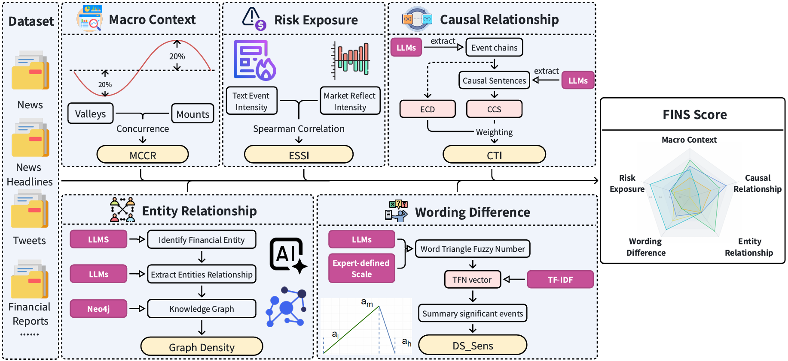
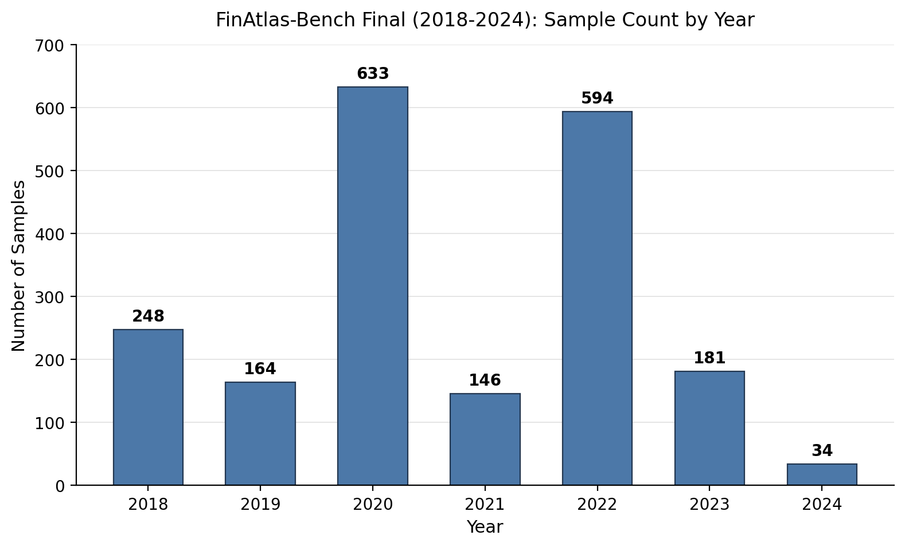
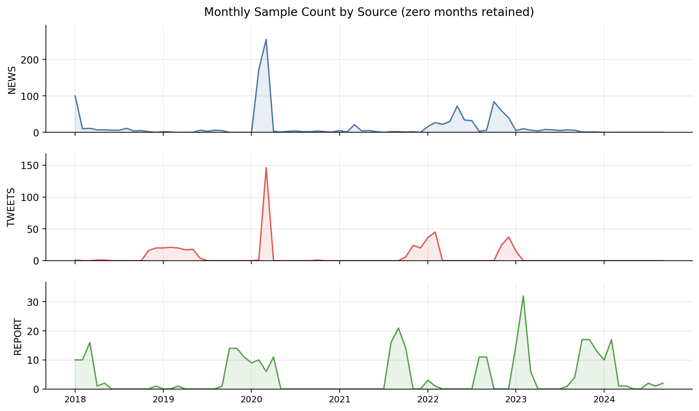

# FinAtlas: A Multi-Task Financial Sentiment Analysis System

[](#)
[](#)
[](#)

FinAtlas is a comprehensive system designed for complex financial sentiment understanding, extending traditional polarity classification into multi-dimensional semantic parsing. This repository provides the instruction-tuning and benchmark datasets reconstructed from a massive-scale raw candidate corpus of approximately 80 million financial texts.

## 📌 Author

**FinAtlas** is constructed by:

- **Di Han** — dihan@gduf.edu.cn
- **Liangzhou Qu** — liangzhqu2-c@my.cityu.edu.hk
- **Junjie Mao** — junjie.mao@audencia.com
- **Yulin He<sup>*</sup>** — yulinhe@gml.ac.cn
- **Qixian Li** — 3260000547@student.must.edu.mo
- **Canwei Dai** — 18318717968@163.com

<sup>*</sup> Corresponding author

## 📌 System Components

The FinAtlas system integrates three core components:

1. **FINS (Data Evaluation Framework):** A task-driven evaluation framework that deconstructs financial sentiment signals across five dimensions.
2. **FinAtlas-SFT (Instruction-Tuning Dataset):** The finalized high-quality supervised fine-tuning dataset. *(Note: This dataset is the final output of our multi-model consensus and structured CoT reasoning pipeline).*
3. **FinAtlas-Bench (Benchmark):** A standardized dataset containing 2,000 independent samples for evaluating the capabilities of various LLMs in comprehending complex financial semantics.

## 🚀 The 5-Dimensional FINS Framework

Unlike datasets focused solely on sentiment polarity, FinAtlas aligns and evaluates models across the following five dimensions:

* **Macro Context:** Identifies the external market conditions or macro environment surrounding the text.
* **Risk Exposure:** Assesses the degree to which entities, assets, or markets are exposed to negative events and abnormal volatility.
* **Causal Relationship:** Extracts and evaluates the causal links and event transmission mechanisms.
* **Entity Relationship:** Identifies financial entities and extracts their interactive relationship networks.
* **Wording Difference:** Judges how shifts in expression impact sentiment intensity and signal semantics.



---

## 📂 Datasets Access & Structure

We provide 5 SFT datasets corresponding to the 5 dimensions, and 1 unified benchmark dataset. The datasets are hosted in `.parquet` format for efficient loading.

### Quick Start
You can load the dataset directly using `pandas` or the Hugging Face `datasets` library:

```python
import pandas as pd

# Option 1: pandas (only requires pandas + pyarrow)
df_bench = pd.read_parquet("FinAtlas_Bench.parquet")
print(df_bench.head())

from datasets import load_dataset

# Option 2: Hugging Face datasets
ds_bench = load_dataset("parquet", data_files="FinAtlas_Bench.parquet")
print(ds_bench.head())

```

### Data Dictionary

Each record follows the multidimensional JSON schema introduced in Chapter 3 of the paper (a complete example is provided in the Sample Record below, reproduced from Appendix 3 of the paper):

| Field | Description | Type / Values |
| --- | --- | --- |
| `Text` | The original financial text (News, Tweet, or Report). | String |
| `Fundamental_Labels.Timestamp` | The trading date or event date corresponding to the text. | String (e.g., `2022/12/19`) |
| `Fundamental_Labels.Type` | Corpus source type. | String: `NEWS`, `TWEET`, `REPORT` |
| `Fundamental_Labels.Sentiment_Polarity` | Overall polarity of the text. | String: `BEARISH`, `BULLISH`, `NEUTRAL` |
| `Fundamental_Labels.Sentiment_Probability` | Model-generated confidence for the sentiment polarity label. | Float (e.g., `0.9765625`) |
| `Macro_Context.Market_Regime` | External market phase in which the text is situated. | String: `BULL`, `BEAR` |
| `Macro_Context.Macro_Event` | Major external events discussed in the text (e.g., COVID-19, monetary policy adjustments, regulatory changes). | List of Dict: `{anchor, confidence}` |
| `Risk_Exposure.Risk_Category` | Nature of the risk. A row may contain more than one category. | List of String: `Market Risk`, `Credit Risk`, `Liquidity Risk`, `Operational Risk`, `None` |
| `Risk_Exposure.Risk_Level` | Severity or potential impact of the risk. Actual values: `NO RISK`, `LOW RISK`, `HIGH RISK`; no `MEDIUM` level exists in this file. | String (e.g., `HIGH RISK`) |
| `Risk_Exposure.Risk_Triplets` | Risk source and affected target for each identified risk. | List of Dict: `{risk_category, risk_source, affected_object}` |
| `Causal_Relationship.Chain_Complexity` | Complexity of the causal transmission structure. | String: no causal relationship, `SINGLE`, `MULTIPLE` |
| `Causal_Relationship.Causal_Paths` | Causal chains preserving the cause, mechanism, and effect. | List of Dict: `{Chain_ID, Cause, Mechanism, Effect}` |
| `Entity_Relationship.Entity_Recognition` | Recognized financial entities (companies, institutions, individuals, financial indicators, stock tickers). | List of Dict: `{Entity_Name, Type}` with Type: `ORG`, `LOC`, `PER`, `FIN` |
| `Entity_Relationship.Relation_Extraction` | Relationship type and direction between entities, covering 9 categories (e.g., `ACQUISITION_MERGER`, `REGULATORY_ACTION`). | List of Dict: `{Relation, Clean_Entities}` |
| `Wording_Difference.Rhetoric_Type` | Expression mode of the text. | String: `OBJECTIVE_FACT`, `SUBJECTIVE_PREDICTION`, `EMOTIONAL_EXAGGERATION`, `VAGUE_RUMOR`, `NO_SPECIFIC_RHETORIC` |
| `Wording_Difference.Fuzzy_Text_Confidence` | Model uncertainty in rhetoric and sentiment judgment, derived from the triangular fuzzy number. | String / Float (e.g., `HIGH`) |

### Sample Record in FinAtals-Bench

The following JSON object is a real FinAtlas-Bench sample reproduced from Appendix 3 of the paper. It illustrates the complete multidimensional extraction results, including fundamental labels, macro context, risk exposure, causal relationship, entity relationship, and wording difference:

```json
{
  "Text": "Wall Street Closes Lower for a 4th Day Wall Street Closes Lower for a 4th DayUnited States Stock MarketUS stocks closed lower for a fourth straight session Monday, as concerns over a recession in the US mounted after the Fed took a more hawkish tone than expected. Chair Powell said last week the central bank would continue its monetary policy tightening campaign, despite the ongoing recession risks and expectations that inflation is peaking. Among single stocks, Meta Platforms dropped 4.1% after the European Commission said it could impose a fine of up to 10% of its annual global turnover if evidence showed an infringement of the EU's antitrust laws, while L3 Harris Technologies fell 3.7% after saying it would buy Aerojet Rocketdyne Holdings for $4.7 billion. On the economic data front, US homebuilder sentiment fell for a 12th month as high mortgage rates weighed on affordability. The Dow Jones fell 163 points, or 0.5%, to 32,758, the S&P 500 lost 0.9% to 3,818, and the Nasdaq Composite shed 1.5% to 10,546. Stocks are on track to end December lower after two consecutive weeks in the red.2022-12-19T21:12:56.66",
  "Fundamental_Labels": {
    "Timestamp": "2022/12/19",
    "Type": "NEWS",
    "Sentiment_Polarity": "BEARISH",
    "Sentiment_Probability": "0.9765625"
  },
  "Macro_Context": {
    "Market_Regime": "BULL",
    "Macro_Event": [
      {
        "anchor": "Fed hawkish tightening amid recession risks",
        "confidence": "High"
      }
    ]
  },
  "Risk_Exposure": {
    "Risk_Category": [
      "Market Risk",
      "Operational Risk"
    ],
    "Risk_Level": "HIGH RISK",
    "Risk_Triplets": [
      {
        "risk_category": "Market Risk",
        "risk_source": "Recession concerns and hawkish Fed tone",
        "affected_object": "US stock market indices"
      },
      {
        "risk_category": "Operational Risk",
        "risk_source": "Potential EU antitrust fine",
        "affected_object": "Meta Platforms"
      },
      {
        "risk_category": "Market Risk",
        "risk_source": "Acquisition announcement",
        "affected_object": "L3 Harris Technologies"
      }
    ]
  },
  "Causal_Relationship": {
    "Chain_Complexity": "SINGLE",
    "Causal_Paths": [
      {
        "Chain_ID": 1,
        "Cause": "Fed took a more hawkish tone than expected",
        "Mechanism": "raising concerns over a recession in the US",
        "Effect": "US stocks closed lower for a fourth straight session"
      }
    ]
  },
  "Entity_Relationship": {
    "Entity_Recognition": [
      {
        "Entity_Name": "Wall Street",
        "Type": "LOC"
      },
      {
        "Entity_Name": "United States",
        "Type": "LOC"
      },
      {
        "Entity_Name": "US",
        "Type": "LOC"
      },
      {
        "Entity_Name": "Fed",
        "Type": "ORG"
      },
      {
        "Entity_Name": "Powell",
        "Type": "PER"
      },
      {
        "Entity_Name": "Meta Platforms",
        "Type": "ORG"
      },
      {
        "Entity_Name": "European Commission",
        "Type": "ORG"
      },
      {
        "Entity_Name": "EU",
        "Type": "ORG"
      },
      {
        "Entity_Name": "L3 Harris Technologies",
        "Type": "ORG"
      },
      {
        "Entity_Name": "Aerojet Rocketdyne Holdings",
        "Type": "ORG"
      },
      {
        "Entity_Name": "Dow Jones",
        "Type": "FIN"
      },
      {
        "Entity_Name": "S&P 500",
        "Type": "FIN"
      },
      {
        "Entity_Name": "Nasdaq Composite",
        "Type": "FIN"
      }
    ],
    "Relation_Extraction": [
      {
        "Relation": "ACQUISITION_MERGER",
        "Clean_Entities": [
          "L3 Harris Technologies",
          "Aerojet Rocketdyne Holdings"
        ]
      },
      {
        "Relation": "REGULATORY_ACTION",
        "Clean_Entities": [
          "European Commission",
          "Meta Platforms"
        ]
      }
    ]
  },
  "Wording_Difference": {
    "Rhetoric_Type": "OBJECTIVE_FACT",
    "Fuzzy_Text_Confidence": "HIGH"
  }
}
```

---

### FinAtlas-Bench EDA

#### 1. Time Span and Yearly Distribution

- Time span: `2018-01-01` to `2024-09-01`.
- All 2,000 records have valid `Timestamp` values; no missing or blank timestamps were found.
- Yearly sample counts map:



#### 2. Crisis-Window Coverage of S&P 500 Stress Episodes

The file starts in 2018, so earlier S&P 500 stress episodes (e.g., the 2008 global financial crisis and the 2000 dot-com bust) are **outside the covered range**. For episodes inside 2018-2024, we report both the number of records whose timestamps fall inside the window and the number of records whose text or event labels explicitly mention the episode. Direct mentions are estimated with a case-insensitive keyword scan over `Text`, `Macro_Event`, `Risk_Categories`, and `Risk_Triplets`, so the counts should be treated as lower-bound evidence rather than an exact classification.

| S&P 500 stress episode | Analysis window | Samples in window | Direct mentions | Coverage assessment |
| --- | --- | ---: | ---: | --- |
| 2018 Q4 sell-off / near bear market | 2018-10-01 to 2018-12-31 | 44 | 0 | Temporal coverage exists, but macro-event content is not concentrated in this window. |
| 2019 US-China trade escalation and growth scare | 2019-05-01 to 2019-08-31 | 37 | 0 | Weak content coverage. |
| 2020 COVID-19 pandemic shock and market crash | 2020-02-01 to 2020-04-30 | 604 | 251 | Strong coverage; 2020-02/03 carries the largest sample mass. |
| 2021 Evergrande / Fed taper risk-off episode | 2021-08-01 to 2021-12-31 | 108 | 3 | Only limited general inflation/Fed-related text; no direct Evergrande mention. |
| 2022 Russia-Ukraine shock, Fed tightening, and S&P 500 bear market | 2022-01-01 to 2022-12-31 | 594 | Russia/Ukraine/sanctions: 42; inflation/Fed: 172 | Strong temporal and thematic coverage. |
| 2023 banking-system stress (Silicon Valley Bank / Credit Suisse) | 2023-03-01 to 2023-04-30 | 16 | 0 | Almost no direct coverage: only one retrospective mention (2023-09-29) exists in the whole file. |
| 2023 US debt-ceiling standoff / Fitch downgrade | 2023-05-01 to 2023-08-31 | 28 | 0 | No direct coverage found. |
| 2024 yen-carry-trade unwind / global risk-off | 2024-08-01 to 2024-09-30 | 3 | 0 | No direct coverage; 2024 has only 34 samples in total. |

Overall, the 2018-2024 replaced benchmark strongly covers the **2020 COVID-19 shock** and the **2022 S&P 500 bear market**, while the **2023 SVB/Credit Suisse banking-stress window** is temporally sparse and not directly represented by event-specific text.

#### 3. Source Composition and Time Coverage

| Type | Samples | Share |
| --- | ---: | ---: |
| `NEWS` | 1,173 | 58.65% |
| `TWEETS` | 494 | 24.70% |
| `REPORT` | 333 | 16.65% |
| **Total** | **2,000** | **100%** |

Note: the actual `Type` value in the parquet is `TWEETS` (plural), while the Data Dictionary above writes `TWEET`. The parquet spelling is used here.

| Type | First sample | Last sample | Month-level coverage |
| --- | --- | --- | --- |
| `NEWS` | `2018-01-01` | `2023-12-01` | 62 non-empty months out of a 72-month span; no 2024 samples. |
| `TWEETS` | `2018-01-24` | `2023-01-13` | 22 non-empty months out of a 61-month span; sparse and no 2024 samples. |
| `REPORT` | `2018-01-10` | `2024-09-01` | 37 non-empty months out of an 81-month span; the only source with 2024 samples. |

To show the monthly sample-volume perspective, the faceted line chart below retains zero months and gives each source its own panel, so the much larger `NEWS` peaks do not compress `TWEETS` and `REPORT`.



#### 4. Dimension Label Coverage and Distribution

The coverage table below counts a list field as valid when it contains at least one element. `NONE` and `NO RISK` are treated as valid labels, not missing values.

| Field | Valid / non-empty rows | Coverage |
| --- | ---: | ---: |
| `Sentiment_Polarity` | 2,000 | 100.0% |
| `Macro_Market_Regime` | 2,000 | 100.0% |
| `Macro_Event` | 846 | 42.3% |
| `Risk_Categories` | 2,000 | 100.0% |
| `Risk_Level` | 2,000 | 100.0% |
| `Risk_Triplets` | 2,000 | 100.0% |
| `Causal_Chain_Complexity` | 2,000 | 100.0% |
| `Causal_Paths` | 800 | 40.0% |
| `Entity_Recognition` | 1,960 | 98.0% |
| `Entity_Relation_Extraction` | 556 | 27.8% |
| `Wording_Rhetoric_Type` | 2,000 | 100.0% |
| `Wording_Fuzzy_Text_Confidence` | 2,000 | 100.0% |

`Risk_Categories` and `Risk_Triplets` are always present as lists, but 651 rows are labeled as no-risk (`None`); 1,349 rows (67.45%) contain at least one actual risk category.

**Sentiment polarity**

| `Sentiment_Polarity` | Count | Share |
| --- | ---: | ---: |
| `NEUTRAL` | 1,156 | 57.80% |
| `BEARISH` | 732 | 36.60% |
| `BULLISH` | 112 | 5.60% |

**Macro context and risk exposure**

| `Macro_Market_Regime` | Count | Share |
| --- | ---: | ---: |
| `BULL` | 1,240 | 62.00% |
| `BEAR` | 760 | 38.00% |

| `Risk_Level` | Count | Share |
| --- | ---: | ---: |
| `NO RISK` | 651 | 32.55% |
| `LOW RISK` | 855 | 42.75% |
| `HIGH RISK` | 494 | 24.70% |

| `Risk_Categories` | Rows containing category | Row hit rate |
| --- | ---: | ---: |
| `Market Risk` | 993 | 49.65% |
| `Operational Risk` | 660 | 33.00% |
| `Liquidity Risk` | 190 | 9.50% |
| `Credit Risk` | 172 | 8.60% |
| `None` | 651 | 32.55% |

One record can contain multiple risk categories, so the row hit rates do not sum to 100%.

**Causal relationship**

| `Causal_Chain_Complexity` | Count | Share |
| --- | ---: | ---: |
| `NONE` | 1,200 | 60.00% |
| `SINGLE` | 551 | 27.55% |
| `MULTIPLE` | 249 | 12.45% |

`Causal_Paths` is non-empty for the 800 records with `SINGLE` or `MULTIPLE` causal chains.

**Entity relationship**

| Field | Count | Share |
| --- | ---: | ---: |
| `Entity_Recognition` non-empty | 1,960 / 2,000 | 98.00% |
| `Entity_Relation_Extraction` non-empty | 556 / 2,000 | 27.80% |

Entity-type distribution is based on all extracted entity elements (21,874 in total):

| Entity type | Elements | Element share |
| --- | ---: | ---: |
| `ORG` | 7,557 | 34.55% |
| `FIN` | 7,388 | 33.78% |
| `LOC` | 3,629 | 16.59% |
| `PER` | 3,300 | 15.09% |

Relation-type distribution is based on all extracted relations (1,053 in total):

| Relation type | Elements | Element share |
| --- | ---: | ---: |
| `REGULATORY_ACTION` | 256 | 24.31% |
| `INVESTMENT_FINANCING` | 187 | 17.76% |
| `ACQUISITION_MERGER` | 164 | 15.57% |
| `COMPETITION` | 147 | 13.96% |
| `SUPPLY_CHAIN` | 85 | 8.07% |
| `STRATEGIC_PARTNERSHIP` | 75 | 7.12% |
| `EXECUTIVE_CHANGE` | 72 | 6.84% |
| `LEGAL_DISPUTE` | 67 | 6.36% |

**Wording dimension**

| `Wording_Rhetoric_Type` | Count | Share |
| --- | ---: | ---: |
| `OBJECTIVE_FACT` | 1,036 | 51.80% |
| `SUBJECTIVE_PROJECTION` | 560 | 28.00% |
| `EMOTIONAL_HYPERBOLE` | 344 | 17.20% |
| `AMBIGUOUS_RUMOR` | 60 | 3.00% |

The panic/rumor signal combined by `EMOTIONAL_HYPERBOLE` + `AMBIGUOUS_RUMOR` covers 404 records (20.20%).

| `Wording_Fuzzy_Text_Confidence` | Count | Share |
| --- | ---: | ---: |
| `HIGH` | 1,526 | 76.30% |
| `MEDIUM` | 395 | 19.75% |
| `LOW` | 79 | 3.95% |


## 🗂️ Repository Structure

This repository is data-focused and contains the following files:

| File | Description |
| --- | --- |
| `FinAtlas_Bench.parquet` | The unified FinAtlas-Bench benchmark dataset (2,000 independent samples). |
| `FinAtlas_Macro_SFT.parquet` | FinAtlas-SFT instruction-tuning samples for the Macro Context dimension. |
| `FinAtlas_Risk_SFT.parquet` | FinAtlas-SFT instruction-tuning samples for the Risk Exposure dimension. |
| `FinAtlas_Casuality_SFT.parquet` | FinAtlas-SFT instruction-tuning samples for the Causal Relationship dimension. |
| `FinAtlas_Entity_SFT.parquet` | FinAtlas-SFT instruction-tuning samples for the Entity Relationship dimension. |
| `FinAtlas_Wording_SFT.parquet` | FinAtlas-SFT instruction-tuning samples for the Wording Difference dimension. |
| `FinAtlas_Experiment_settings.md` | Experiments setting  detail. |
| `README.md` | Dataset documentation, schema, and a sample record. |

---

## ⚖️ Data Sources & Acknowledgements

The FinAtlas datasets are derived and reconstructed from the following open-source financial corpora. We strictly respect their original licenses and distribute our annotations under non-commercial terms.

| Original Dataset | Source / Reference | Url / Cite |
| --- | --- | --- |
| **financial-news-multisource** | Brianferrell787 | https://huggingface.co/datasets/Brianferrell787/financial-news-multisource |
| **financial-reports-sec** | JanosAudran | https://huggingface.co/datasets/JanosAudran/financial-reports-sec |
| **sp500-edgar-10k-markdown** | BEE-spoke-data | https://huggingface.co/datasets/BEE-spoke-data/sp500-edgar-10k-markdown |
| **sp500_dataset_earnings_sec** | hfmlsoc | https://huggingface.co/datasets/hfmlsoc/sp500_dataset_earnings_sec |
| **financial-tweets** | StephanAkkerman | https://huggingface.co/datasets/StephanAkkerman/financial-tweets |
| **stock_market_tweets** | mjw | https://huggingface.co/datasets/mjw/stock_market_tweets |
| **StockTwits** | StockTwits | https://www.mdpi.com/2571-5577/4/1/13 |

---

## 📖 Citation

If you use FinAtlas or the FINS framework in your research, please cite our paper:

```bibtex
coming soon

```

## 📜 License

* **Code:** Any code or configuration files in this repository are licensed under the [MIT License](https://www.google.com/search?q=LICENSE-CODE).
* **Dataset:** The FinAtlas datasets are licensed under the [Creative Commons Attribution-NonCommercial-ShareAlike 4.0 International License (CC BY-NC-SA 4.0)](https://www.google.com/search?q=LICENSE-DATA). They are intended strictly for academic and non-commercial research purposes.
